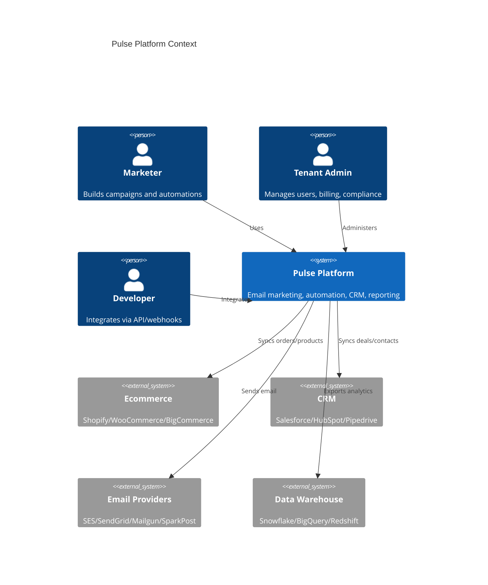
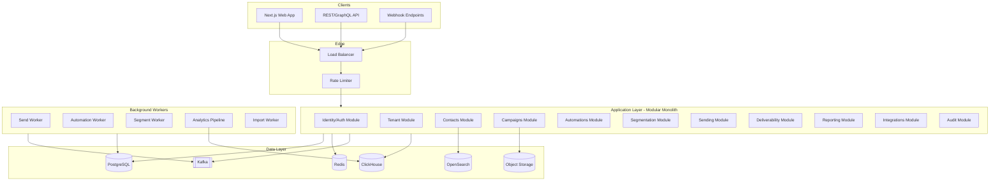
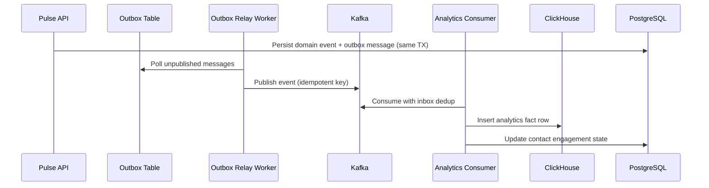

# Pulse Marketing Platform — Technical Blueprint

## Executive Summary

Pulse is an enterprise-grade, multi-tenant email marketing, automation, CRM, and reporting platform designed to compete with ActiveCampaign, Mailchimp, Klaviyo, HubSpot Marketing Hub, Braze, Brevo, and Iterable. The platform addresses known pain points: complex UX, weak editors, expensive scale pricing, limited ecommerce modeling, poor deliverability visibility, shallow reporting, weak attribution, difficult automation debugging, poor data portability, limited auditability, and missing operational controls.

## Product Principles

1. **Reporting-first** — Analytics and drill-down are core product surfaces, not add-ons.
2. **Debuggable automation** — Every workflow decision is explainable per contact.
3. **Transparent deliverability** — Health scores, ISP/domain breakdowns, and actionable guidance.
4. **Tenant isolation by default** — Row-level security, scoped API keys, audited impersonation.
5. **Modular monolith first** — Clear bounded contexts with extraction paths to microservices.
6. **Event-driven core** — Outbox/inbox patterns for reliable cross-context communication.

## System Context



## Bounded Contexts

| Context | Responsibility | Primary Store |
|---------|---------------|---------------|
| Identity/Auth | Users, SSO, MFA, sessions, API keys | PostgreSQL |
| Tenant Management | Orgs, workspaces, brands, RBAC/ABAC | PostgreSQL |
| Contacts | Profiles, identity resolution, consent | PostgreSQL + OpenSearch |
| Campaigns | Email builder, templates, A/B tests | PostgreSQL + S3 |
| Automations | Journey builder, durable execution | PostgreSQL + Temporal |
| Segmentation | Real-time/batch segments | PostgreSQL + Redis |
| Sending | Queue, throttling, provider abstraction | PostgreSQL + Kafka |
| Deliverability | Domains, bounces, complaints, warmup | PostgreSQL |
| Reporting | Dashboards, OLAP, attribution | ClickHouse |
| Integrations | Connectors, webhooks, sync jobs | PostgreSQL |
| Billing/Metering | Usage, quotas, billing events | PostgreSQL |
| Audit/Compliance | Audit logs, GDPR, retention | PostgreSQL |

## High-Level Architecture



## Multi-Tenancy Model

```
Organization (billing entity)
  └── Workspace (operational boundary, data isolation)
        └── Brand (sender identity, domain, brand kit)
              └── Resources (contacts, campaigns, automations)
```

- **Tenant key**: `workspace_id` on all tenant-scoped tables.
- **Isolation**: PostgreSQL RLS policies + application-level tenant context middleware.
- **Cross-tenant access**: Denied by default; platform admin requires audited impersonation.

## Data Flow: Event Ingestion → Reporting



## Technology Stack

| Layer | Technology |
|-------|------------|
| Backend | .NET 9, ASP.NET Core Minimal APIs |
| Frontend | Next.js 15, React 19, TypeScript, Tailwind CSS |
| Transactional DB | PostgreSQL 16 |
| Analytics OLAP | ClickHouse |
| Cache | Redis 7 |
| Message Bus | Kafka (Redpanda for local dev) |
| Workflow Engine | Temporal (Phase 2; custom durable state in Phase 1) |
| Search | OpenSearch |
| Object Storage | MinIO (S3-compatible) |
| Auth | OIDC + JWT; SAML/SCIM enterprise hooks |
| Observability | OpenTelemetry, Prometheus, Grafana |
| Infrastructure | Docker, Kubernetes, Terraform |
| CI/CD | GitHub Actions |

## API Design

- **Versioning**: URL prefix `/api/v1/`
- **Pagination**: Cursor-based (`after`, `limit`)
- **Idempotency**: `Idempotency-Key` header on mutating operations
- **Tenant context**: `X-Workspace-Id` header or JWT claim
- **Error taxonomy**: Structured errors with `code`, `message`, `details`, `trace_id`

## Security Architecture

- OWASP Top 10 mitigations at every layer
- PII field-level encryption for sensitive attributes (AES-256-GCM, tenant-scoped keys)
- API keys: scoped, hashed at rest, rotatable
- Webhooks: HMAC-SHA256 signatures with timestamp validation
- Audit log for all sensitive mutations
- CSRF protection on cookie-based sessions; Bearer tokens for API

## Performance Targets

| Workload | Target |
|----------|--------|
| Contact profile read | < 50ms p95 |
| Segment count estimate | < 2s for 10M contacts (cached) |
| Event ingestion | 50K events/sec per cluster |
| Campaign send throughput | 1M emails/hour per send pool |
| Reporting query (dashboard) | < 3s p95 on 1B events (ClickHouse) |

## Deployment Topology

```
┌─────────────────────────────────────────────────────────┐
│ Kubernetes Cluster                                       │
│  ┌──────────┐  ┌──────────┐  ┌──────────┐              │
│  │ pulse-api│  │ pulse-web│  │ workers  │ (HPA scaled) │
│  └──────────┘  └──────────┘  └──────────┘              │
│  ┌──────────┐  ┌──────────┐  ┌──────────┐              │
│  │ postgres │  │  redis   │  │clickhouse│              │
│  └──────────┘  └──────────┘  └──────────┘              │
└─────────────────────────────────────────────────────────┘
```

## Phase 1 Deliverables (This Repository)

- [x] Architecture blueprint and ADRs
- [x] Repo skeleton with modular monolith backend
- [x] Multi-tenant foundation (org, workspace, user, RBAC)
- [x] Auth model (JWT + API keys)
- [x] Contact model and CRUD APIs
- [x] Campaign model and CRUD APIs
- [x] Event ingestion API and outbox pipeline
- [x] ClickHouse reporting schema
- [x] Docker Compose local stack
- [x] Core frontend screens
- [x] Unit/integration test scaffolding
- [x] CI/CD pipeline

## Phase 2+ Roadmap

- Visual automation journey builder with Temporal
- Drag-and-drop email editor (MJML/React Email)
- Full deliverability platform with IP warmup
- Predictive segments and AI assistant
- Enterprise SSO/SAML/SCIM
- Warehouse sync connectors
